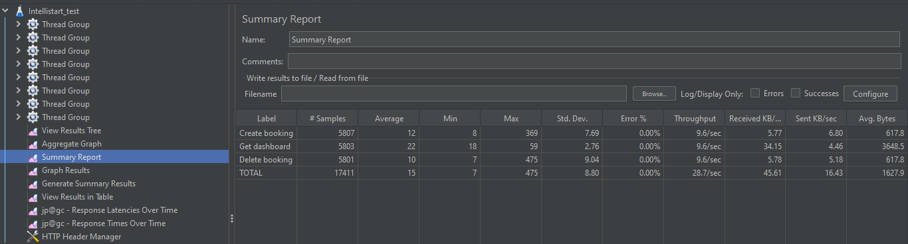
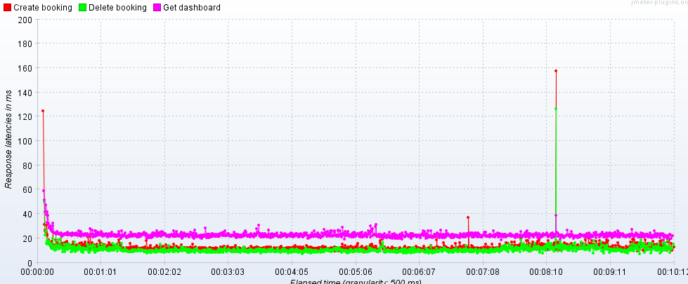

# Interview planning application 
This back-end application is made for coordinating the interviewer's and candidate's assignments. It was created using Spring with Hibernate framework. PostgresSQL was used as a database because of its reliability and excellent performance. Facebook API and Spring Security OAuth2 were used for authentication through Facebook account. Additionally, stress-testing was conducted using Apache Jmeter.<br />
<br />
Main functional requirements described [here.](https://github.com/gavluk-intellias/intellistart-java-project/blob/main/docs/REQUIREMENTS.md)
# Deployment
## Running in Docker
In order to run application in docker container, you should open terminal in the project directory and run the following:
```sh
docker compose up
```
Application will run on localhost:8080 by default.

If it is needed, you can configure ports and other properties in docker-compose.yml.<br />
<br />
First Coordinator and other needed records in the database that will be initialized before the application starts can be configured in data.sql. 

## .properties files
application.properties contains properties about database connection

application-test.properties contains properties about database connection for testing

timezone.properties contains properties about current timezone system is working with.

If necessary change the zone or other properties it must be written in this files

## Performance testing
Load-testing was performed using Apache Jmeter with the following test plan: <br />
* 8 threads perform simultaneously. 
* Each user (thread) adds booking, requests dashboard and delete created booking. Every request performs with a random delay in the range of 0.5 seconds.
* Load testing was performed for 10 minutes straight.<br />
<br />
After conducting test plan, 17495 requests were made without any errors. <br />
<br />
Average latency was under 30 ms, and the highest value was 135 ms. <br />
<br />
To conclude, those performance results totally satisfies the requirements.